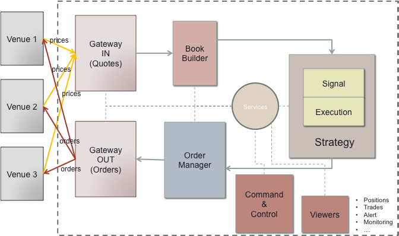

## Trading-BackTester
Building a trading backtester in C++

### Part I Overview of the system
The general system design of the trading backtester is as follows.

There are 6 parts in the backtester: Gateway In, Gateway Out, Book Builder, Strategy, Order Manager and Market Simulator.
The general architecture deisgn is shown below.

#### Order Manager
This class will manage all orders sent to the venues, based on signals generated by the strategy. It will handle sending, canceling and replacing orders as well as accessing information about executed orders, including pending and open orders.

#### Trading Strategy
As the brain of our system, strategies will take limit order book from each venue and make defined decisions based on different parameter and values. Some strategies will need to analyze the entire depth of books, others, just top of the book prices (that’s our case for this implementation), that is the best bid and best ask.

#### Market Simulator
The Market Simulator is here to simulate the response from the market. In the implementation, I will reduce the functionality for now to accept a limit order and fills it. It will reject any orders whose quantity is lower 1000.

### Part II Communications
As we know, processes cannot communicate natively because they do not share the same memory space, therefore I will need to use IPC (Inter Process Communication) to enable communications. The two IPS I will be using the most are Shared Memory and Socket.
When 2 processes run on the same machine, they can use the IPC Shared Memory. Since a Shared Memory doesn't have any Synchronization Mechanism to access a shared data between two processes, it is customary to use a <b>ring buffer</b>.

http://performantcode.com/latency/ring-buffer-a-data-structure-behind-disruptor/

To simplify the implementation for now, I use a queue which will behave as a ring buffer to make the different components communicate. I create 4 queues between the 3 classes (Trading Strategy, Order Manager and Market Simulator).

